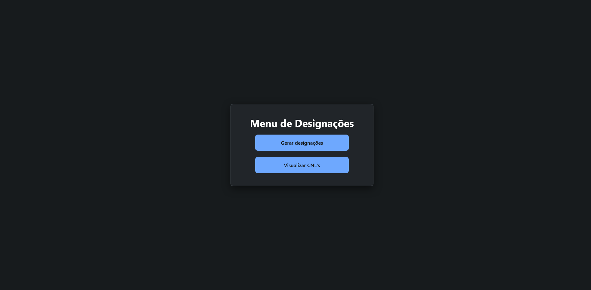
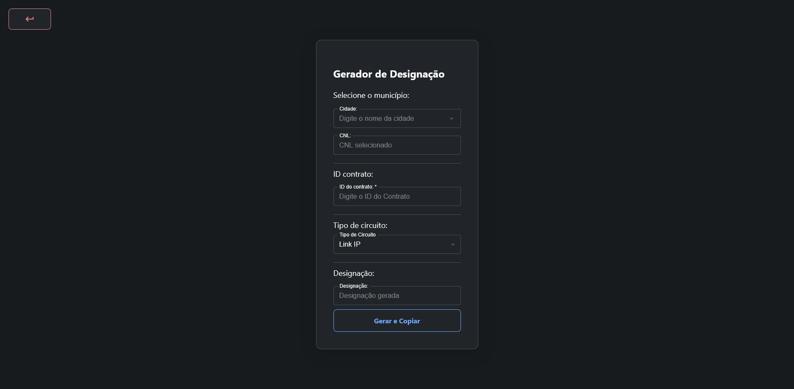

# designations-generator
 ### Resumo:
  O sistema de geração de designações foi pensado para a facilitação no processo de geração das designações e do acesso a informações dos CNL's de cada município.
A necessidade de uma visualização simplificada dos CNL's se dá pelo fato de a interface disponibilizada atualmente pela Anatel ser bastante confusa, o que pode ocasionar dificuldade na pesquisa. Além disso, ao ser criado um sistema no qual os CNL's podem ser cadastrados manualmente, possibilitamos a criação de siglas personalizadas para localidades específicas.

 Sistema para realizar a geração de designações padronizadas para circuitos.
 O sistema também permite cadastrar e visualizar os Códigos Nacionais de Localidades (CNL).
---

# Funcionamento do Systema
 O sistema tem uma interface bem simples, com três páginas principais, sendo elas:

 - Menu Inicial.
 - Página de geração de designações.
 - Página de visualização dos CNL cadastrados.

## Menu Inicial
 No menu inicial, temos as opções de navegação entre as interfaces do sistema, podendo escolher entre a página de criação das designações e a página para a visualização dos CNL's cadastrados.
 

## Página de geração de designações
 Na página de geração das designações, temos o formulário para a criação da designação, de acordo com as informações adicionadas pelo usuário.

 

 > Na página de designações, ao gerar a designação, o conteúdo gerado não é automaticamente copiado para a área de transferência devido a restrições do método HTTP.

## Página de geração de Visualização de CNL
 A página de visualização de CNL permite que o usuário visualize e pesquise, de forma dinâmica e simplificada, as informações de CNL de acordo com a cidade desejada.

